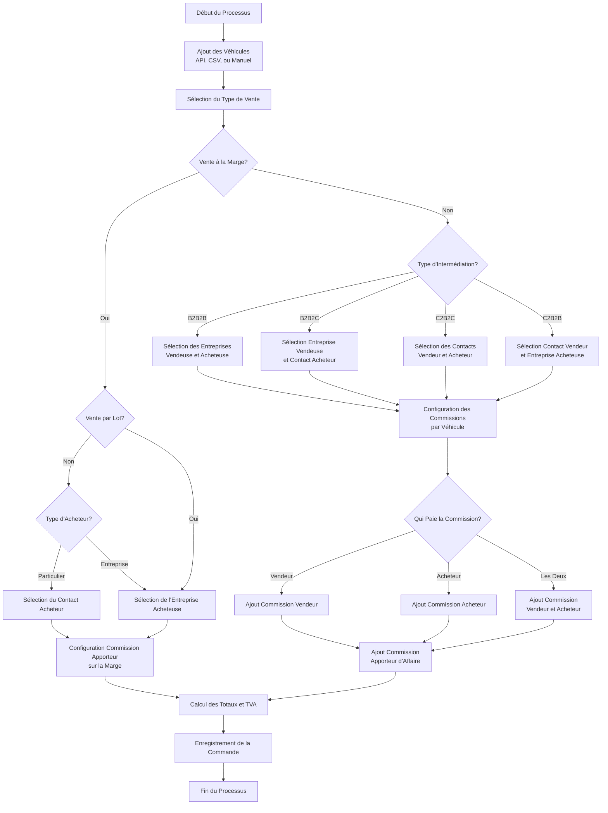
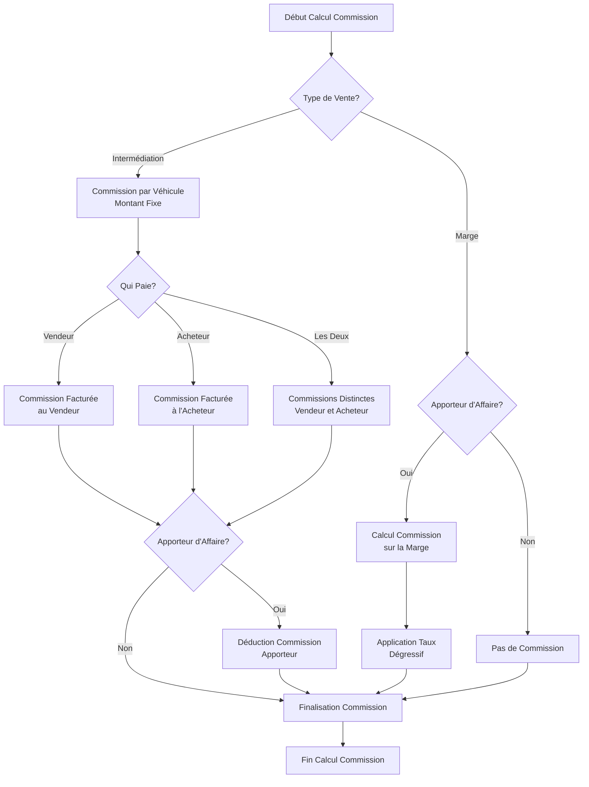
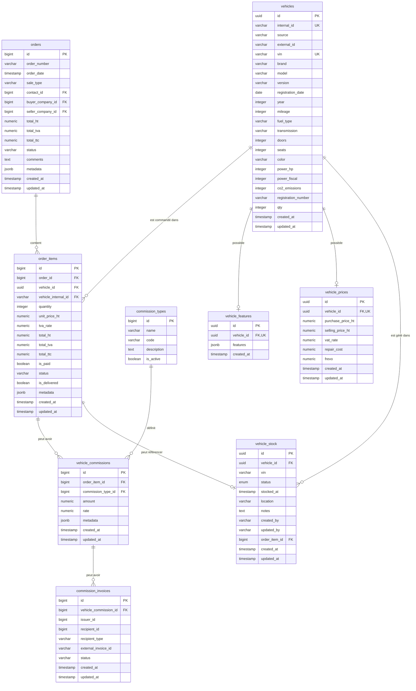
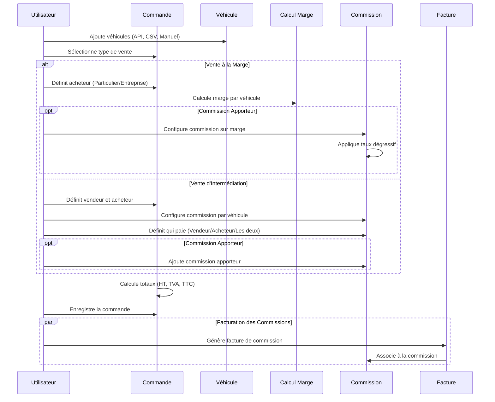

# Diagramme de la Logique des Ventes

Ce document présente la logique métier des ventes dans le module Orders de l'application CRM/ERP spécialisée dans la vente et l'intermédiation de véhicules.

## Types de Vente et Parties Impliquées

```mermaid
graph TB
    subgraph "Types de Vente"
        direction TB
        
        subgraph "Vente à la Marge"
            MARGIN_UNIT["Vente Unitaire<br>(B2C ou B2B)"]
            MARGIN_BULK["Vente par Lot<br>(uniquement B2B)"]
        end
        
        subgraph "Vente d'Intermédiation"
            B2B2B["B2B2B<br>(Entreprise à Entreprise)"]
            B2B2C["B2B2C<br>(Entreprise à Particulier)"]
            C2B2C["C2B2C<br>(Particulier à Particulier)"]
            C2B2B["C2B2B<br>(Particulier à Entreprise)"]
        end
    end
    
    subgraph "Parties Impliquées"
        BUYER_COMPANY["Entreprise Acheteuse"]
        SELLER_COMPANY["Entreprise Vendeuse"]
        BUYER_CONTACT["Contact Acheteur"]
        SELLER_CONTACT["Contact Vendeur"]
        OWNER["Entreprise Owner<br>(Intermédiaire)"]
        BUSINESS_PROVIDER["Apporteur d'Affaire<br>(Société ou Particulier)"]
    end
    
    %% Vente à la marge unitaire
    MARGIN_UNIT -->|"Vendeur"| OWNER
    MARGIN_UNIT -->|"Acheteur"| BUYER_COMPANY
    MARGIN_UNIT -->|"Acheteur"| BUYER_CONTACT
    MARGIN_UNIT -->|"Commission possible"| BUSINESS_PROVIDER
    
    %% Vente à la marge par lot
    MARGIN_BULK -->|"Vendeur"| OWNER
    MARGIN_BULK -->|"Acheteur"| BUYER_COMPANY
    MARGIN_BULK -->|"Commission possible"| BUSINESS_PROVIDER
    
    %% Vente d'intermédiation B2B2B
    B2B2B -->|"Vendeur"| SELLER_COMPANY
    B2B2B -->|"Acheteur"| BUYER_COMPANY
    B2B2B -->|"Intermédiaire"| OWNER
    B2B2B -->|"Commission"| OWNER
    B2B2B -->|"Commission possible"| BUSINESS_PROVIDER
    
    %% Vente d'intermédiation B2B2C
    B2B2C -->|"Vendeur"| SELLER_COMPANY
    B2B2C -->|"Acheteur"| BUYER_CONTACT
    B2B2C -->|"Intermédiaire"| OWNER
    B2B2C -->|"Commission"| OWNER
    B2B2C -->|"Commission possible"| BUSINESS_PROVIDER
    
    %% Vente d'intermédiation C2B2C
    C2B2C -->|"Vendeur"| SELLER_CONTACT
    C2B2C -->|"Acheteur"| BUYER_CONTACT
    C2B2C -->|"Intermédiaire"| OWNER
    C2B2C -->|"Commission"| OWNER
    C2B2C -->|"Commission possible"| BUSINESS_PROVIDER
    
    %% Vente d'intermédiation C2B2B
    C2B2B -->|"Vendeur"| SELLER_CONTACT
    C2B2B -->|"Acheteur"| BUYER_COMPANY
    C2B2B -->|"Intermédiaire"| OWNER
    C2B2B -->|"Commission"| OWNER
    C2B2B -->|"Commission possible"| BUSINESS_PROVIDER
```



## Processus de Vente



## Logique de Calcul des Commissions



## Logique de Calcul de TVA

```mermaid
flowchart TD
    START[Calcul TVA] --> SALE_TYPE{Type de Vente}
    
    %% Vente à la marge
    SALE_TYPE -->|Marge| BUYER_TYPE{Type d'Acheteur?}
    BUYER_TYPE -->|Particulier| APPLY_SELLER_COUNTRY[Taux du Pays du Vendeur<br>(Owner)]
    
    BUYER_TYPE -->|Entreprise| COUNTRY_CHECK{Même Pays?}
    COUNTRY_CHECK -->|Oui| LOCAL_RATE[Taux Local du Pays]
    COUNTRY_CHECK -->|Non| EU_CHECK{Tous deux dans UE?}
    
    EU_CHECK -->|Oui| IS_B2B{Vente B2B?}
    IS_B2B -->|Oui| ZERO_TVA[Pas de TVA (0%)]
    IS_B2B -->|Non| SELLER_COUNTRY[Taux du Pays<br>du Vendeur]
    
    EU_CHECK -->|Non| SELLER_COUNTRY
    
    %% Vente d'intermédiation
    SALE_TYPE -->|Intermédiation| INTERMEDIATION_PARTIES{Parties Impliquées}
    INTERMEDIATION_PARTIES --> CALC_FOR_EACH[Calcul Séparé<br>pour Chaque Partie]
    
    CALC_FOR_EACH --> COMPANY_COUNTRY_CHECK{Même Pays pour<br>les Entreprises?}
    COMPANY_COUNTRY_CHECK -->|Oui| INTER_LOCAL_RATE[Taux Local]
    COMPANY_COUNTRY_CHECK -->|Non| INTER_EU_CHECK{Tous dans UE?}
    
    INTER_EU_CHECK -->|Oui| INTER_B2B{Entre Entreprises?}
    INTER_B2B -->|Oui| INTER_ZERO_TVA[Pas de TVA (0%)]
    INTER_B2B -->|Non| INTER_SELLER_RATE[Taux du Pays<br>du Vendeur]
    
    INTER_EU_CHECK -->|Non| INTER_SELLER_RATE
    
    APPLY_SELLER_COUNTRY --> FINAL_CALC[Calcul Final]
    LOCAL_RATE --> FINAL_CALC
    ZERO_TVA --> FINAL_CALC
    SELLER_COUNTRY --> FINAL_CALC
    INTER_LOCAL_RATE --> FINAL_CALC
    INTER_ZERO_TVA --> FINAL_CALC
    INTER_SELLER_RATE --> FINAL_CALC
    
    FINAL_CALC --> END[Fin Calcul TVA]
```

## Relations entre Entités



## Notes sur les Contraintes de Données

La table `orders` possède une contrainte de validation qui impose des règles selon le type de vente:

- Pour `sale_type='B2C'`: `contact_id` doit être renseigné, `buyer_company_id` et `seller_company_id` doivent être NULL
- Pour `sale_type='B2B'`: `buyer_company_id` doit être renseigné, `contact_id` et `seller_company_id` doivent être NULL
- Pour `sale_type='B2B2B'`: `buyer_company_id` et `seller_company_id` doivent être renseignés, `contact_id` doit être NULL

Pour les nouveaux types d'intermédiation (B2B2C, C2B2C, C2B2B), des modifications de schéma seront nécessaires. Ces types pourraient être gérés via le champ `metadata` en attendant la mise à jour du modèle de données.

## Gestion des Véhicules et du Stock

Le système gère les véhicules à travers plusieurs tables spécialisées:

- `vehicles`: Contient les informations de base sur chaque véhicule (marque, modèle, VIN, etc.)
- `vehicle_features`: Stocke les caractéristiques détaillées du véhicule sous forme de JSON
- `vehicle_prices`: Gère les informations de prix (achat, vente, TVA, coûts de réparation)
- `vehicle_stock`: Suit l'état du stock des véhicules (commandé, en stock, vendu, etc.)

Un véhicule peut exister dans le système sans être nécessairement en stock. Le stock est lié à une instance physique d'un véhicule, tandis que la table `vehicles` peut contenir des véhicules qui sont en commande, proposés à la vente, ou simplement dans le catalogue.

L'intégration entre les ventes et le stock se fait via la table `vehicle_stock` qui peut référencer un `order_item_id`, ce qui permet de suivre quels véhicules en stock sont associés à quelles commandes.

## Flux de Travail des Commissions

